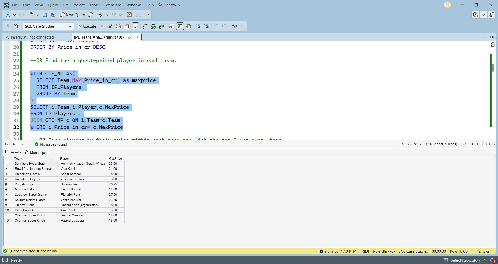
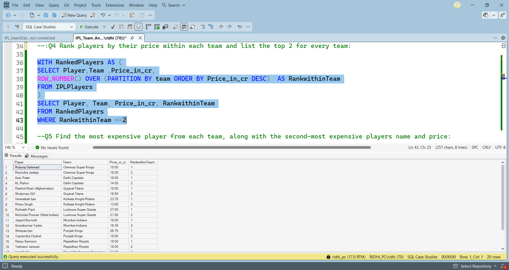
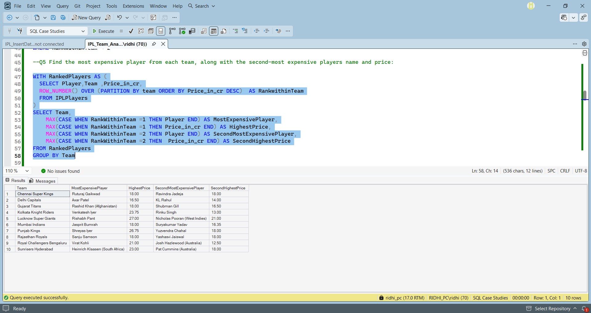
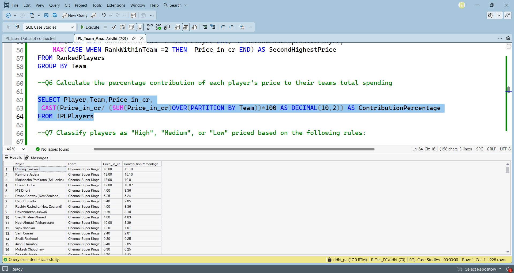
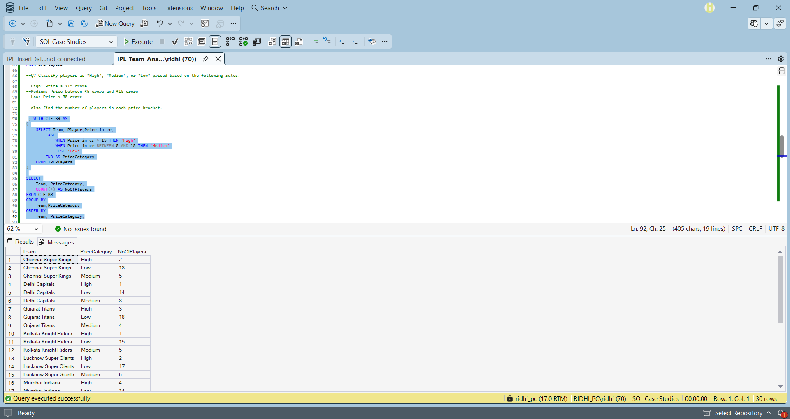
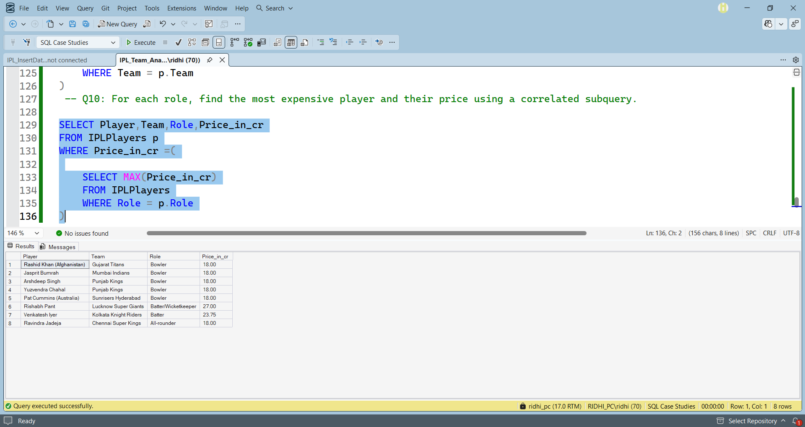

#  SQL IPL Team Analysis

## Overview
This project analyzes IPL player auction data using SQL Server to answer business-related questions and demonstrate SQL skills.

## Tools Used
- SQL Server
- SQL Server Management Studio (SSMS)

## SQL Concepts
- SELECT
- GROUP BY
- ORDER BY
- Aggregate Functions
- CASE
- HAVING
- CTE
- Window Functions
- Joins
- Subqueries

## Project Files
- 'IPL_InsertData.sql' – Dataset insertion script
- `IPL_Team_Analysis.sql' – SQL queries and solutions

## Key Insights
- Team-wise player spending
- Highest-paid players
- Role-wise player analysis
- Team spending comparison
- Player price categorization
- Ranking using window functions

 ## 📸 Project Screenshots

### Q3 – Highest-Priced Player in Each Team

### Q4 – Top 2 Players in Each Team

### Q5 – Most Expensive and Second Most Expensive Players

### Q6 – Percentage Contribution to Team Spending

### Q7 – Price Category Analysis

### Q10 – Most Expensive Player by Role

## How to Run
1. Execute `IPL_InsertData.sql`.
2. Execute `IPL_Team_Analysis.sql`.
3. Run the queries in `IPL_Team_Analysis.sql`.

